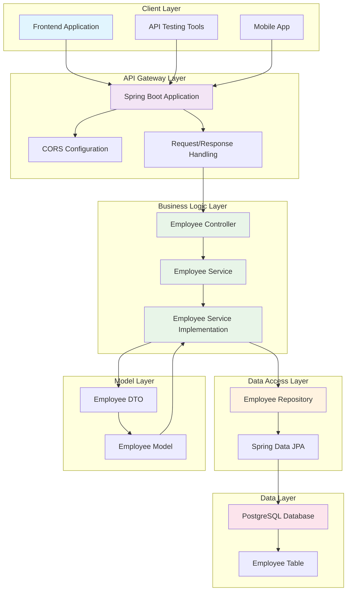
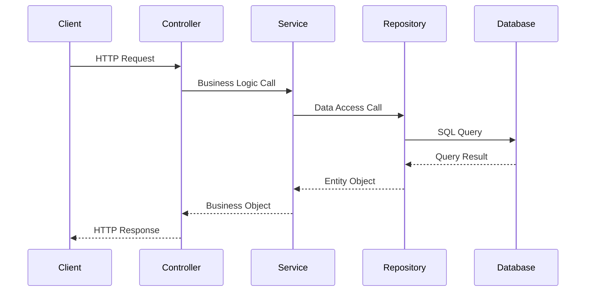

# Employee Management System - Backend API

A robust, production-ready RESTful API for employee management built with Spring Boot 3.2.5 and PostgreSQL. This backend service provides comprehensive CRUD operations for employee data management with proper separation of concerns, data validation, and enterprise-grade architecture.

## 🏗️ System Architecture



## 🔄 Request Flow Diagram



## ✨ Key Features

- **RESTful API Design**: Follows REST conventions with proper HTTP methods
- **Layered Architecture**: Clean separation of concerns (Controller → Service → Repository)
- **Data Validation**: Input validation and error handling
- **CORS Support**: Cross-origin resource sharing enabled for frontend integration
- **Database Integration**: PostgreSQL with JPA/Hibernate ORM
- **Docker Support**: Containerized deployment ready
- **Environment Configuration**: Externalized configuration management
- **Lombok Integration**: Reduced boilerplate code

## 🛠️ Technology Stack

| Component | Technology | Version |
|-----------|------------|---------|
| **Language** | Java | 17 |
| **Framework** | Spring Boot | 3.2.5 |
| **Database** | PostgreSQL | Latest |
| **ORM** | Spring Data JPA | 3.2.5 |
| **Build Tool** | Maven | Latest |
| **Container** | Docker | Latest |
| **Utilities** | Lombok | Latest |

## 📋 Prerequisites

- **Java 17** or later
- **Maven 3.6+**
- **PostgreSQL 12+**
- **Docker** (optional)

## 🚀 Quick Start

### 1. Clone the Repository

```bash
git clone https://github.com/yourusername/employee-management-system-backend.git
cd employee-management-system-backend
```

### 2. Database Setup

```sql
CREATE DATABASE employee_db;
CREATE USER employee_user WITH PASSWORD 'your_password';
GRANT ALL PRIVILEGES ON DATABASE employee_db TO employee_user;
```

### 3. Environment Configuration

Create `application-local.yml` in `src/main/resources/`:

```yaml
spring:
  datasource:
    url: jdbc:postgresql://localhost:5432/employee_db
    username: employee_user
    password: your_password
    driver-class-name: org.postgresql.Driver
  jpa:
    show-sql: true
    hibernate:
      ddl-auto: update
    database-platform: org.hibernate.dialect.PostgreSQLDialect

server:
  port: 8080
```

### 4. Build and Run

```bash
# Build the project
mvn clean install

# Run the application
mvn spring-boot:run
```

The API will be available at `http://localhost:8080`

## 🐳 Docker Deployment

### Build Docker Image

```bash
docker build -t employee-management-backend .
```

### Run with Docker Compose

Create `docker-compose.yml`:

```yaml
version: '3.8'
services:
  app:
    build: .
    ports:
      - "8080:8080"
    environment:
      - POSTGRES_HOST=db
      - POSTGRES_PORT=5432
      - POSTGRES_DB=employee_db
      - POSTGRES_USER=employee_user
      - POSTGRES_PASSWORD=your_password
    depends_on:
      - db
  
  db:
    image: postgres:15
    environment:
      - POSTGRES_DB=employee_db
      - POSTGRES_USER=employee_user
      - POSTGRES_PASSWORD=your_password
    ports:
      - "5432:5432"
    volumes:
      - postgres_data:/var/lib/postgresql/data

volumes:
  postgres_data:
```

Run with:
```bash
docker-compose up -d
```

## 📚 API Documentation

### Base URL
```
http://localhost:8080/api/v1
```

### Endpoints

| Method | Endpoint | Description | Request Body | Response |
|--------|----------|-------------|--------------|----------|
| `POST` | `/employees` | Create employee | Employee object | Created employee |
| `GET` | `/employees` | Get all employees | - | Employee list |
| `GET` | `/employees/{id}` | Get employee by ID | - | Employee object |
| `PUT` | `/employees/{id}` | Update employee | Employee object | Updated employee |
| `DELETE` | `/employees/{id}` | Delete employee | - | Deleted employee |

### Request/Response Examples

#### Create Employee
```http
POST /api/v1/employees
Content-Type: application/json

{
  "firstName": "John",
  "lastName": "Doe",
  "emailId": "john.doe@company.com"
}
```

#### Response
```json
{
  "id": 1,
  "firstName": "John",
  "lastName": "Doe",
  "emailId": "john.doe@company.com"
}
```

## 🏛️ Project Structure

```
src/
├── main/
│   ├── java/com/harsh/employee/
│   │   ├── controller/          # REST API endpoints
│   │   ├── service/             # Business logic layer
│   │   ├── repository/          # Data access layer
│   │   ├── entity/              # JPA entities
│   │   ├── model/               # DTOs and models
│   │   └── EmployeeSystemBackendApplication.java
│   └── resources/
│       └── application.yml      # Configuration
└── test/                        # Unit and integration tests
```

## 🔧 Configuration

### Environment Variables

| Variable | Description | Default |
|----------|-------------|---------|
| `POSTGRES_HOST` | Database host | `localhost` |
| `POSTGRES_PORT` | Database port | `5432` |
| `POSTGRES_DB` | Database name | `employee_db` |
| `POSTGRES_USER` | Database user | `root` |
| `POSTGRES_PASSWORD` | Database password | `password` |

### CORS Configuration

The API is configured to accept requests from:
- `http://localhost:5173` (Development)
- `https://employee-management-system-frontend-hazel.vercel.app/` (Production)

## 🧪 Testing

```bash
# Run all tests
mvn test

# Run with coverage
mvn test jacoco:report
```

## 📊 Performance Considerations

- **Connection Pooling**: HikariCP for database connections
- **Caching**: Ready for Redis integration
- **Monitoring**: Spring Boot Actuator ready
- **Logging**: Structured logging with SLF4J

## 🔒 Security Features

- Input validation and sanitization
- SQL injection prevention through JPA
- CORS configuration for controlled access
- Prepared statements for database queries

## 🚀 Deployment

### Production Deployment

1. **Environment Setup**
   ```bash
   export POSTGRES_HOST=your-db-host
   export POSTGRES_USER=your-db-user
   export POSTGRES_PASSWORD=your-secure-password
   ```

2. **Build for Production**
   ```bash
   mvn clean package -DskipTests
   ```

3. **Deploy**
   ```bash
   java -jar target/employee-system-backend-0.0.1-SNAPSHOT.jar
   ```

## 🤝 Contributing

1. Fork the repository
2. Create a feature branch (`git checkout -b feature/amazing-feature`)
3. Commit your changes (`git commit -m 'Add amazing feature'`)
4. Push to the branch (`git push origin feature/amazing-feature`)
5. Open a Pull Request

## 📄 License

This project is licensed under the MIT License - see the [LICENSE](LICENSE) file for details.

## 👨‍💻 Author

**Your Name**
- GitHub: [@yourusername](https://github.com/yourusername)
- LinkedIn: [Your LinkedIn](https://linkedin.com/in/yourprofile)

## 🙏 Acknowledgments

- Spring Boot team for the excellent framework
- PostgreSQL community for the robust database
- All contributors and reviewers

---

⭐ **Star this repository if you find it helpful!**